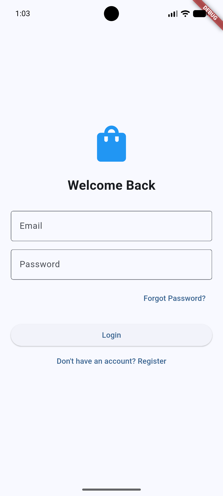
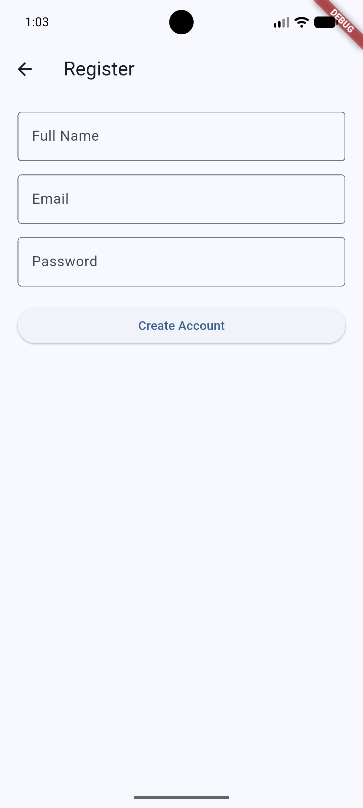
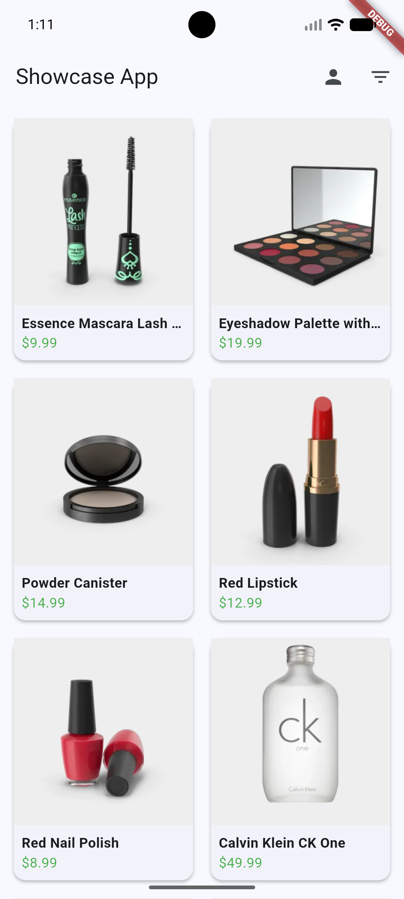
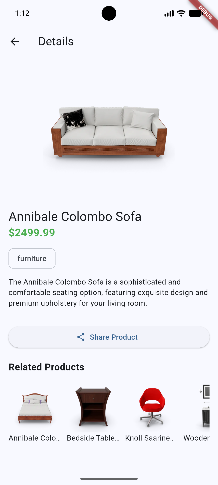
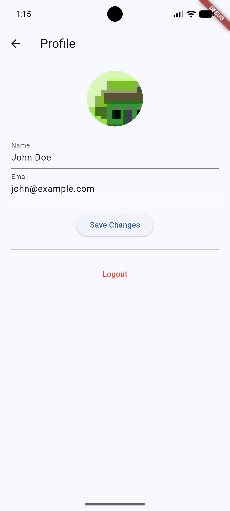
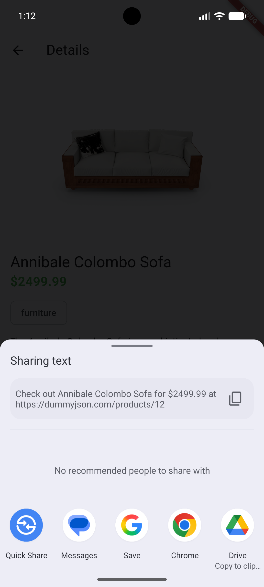

# Product Showcase Mobile App

A production-ready Flutter application designed to demonstrate modern mobile development best practices. This project implements a complete e-commerce flow, featuring Authentication, REST API integration, State Management (Provider), and Local Persistence in a clean architecture.

## Features

### 1. Authentication Module
* **Registration & Login:** Fully simulated user authentication flows.
* **Secure Storage:** Implements `flutter_secure_storage` to securely handle access tokens.
* **Forgot Password:** UI and logic for OTP verification and password recovery.

### 2. Product Listing
* **Grid Layout:** Responsive grid displaying products with thumbnail, title, and price.
* **Filtering Logic:** Real-time filtering by **Category** and **Price Range**.
* **Data Source:** Integrated with the DummyJSON API for dynamic data fetching.

### 3. Product Details
* **Interactive UI:** Features an image carousel slider for browsing product photos.
* **Detailed Information:** Displays comprehensive product specs, descriptions, and pricing.
* **Related Products:** Logic to fetch and suggest similar items from the same category.
* **Social Sharing:** Native system share sheet integration to share product links.

### 4. Profile Management
* **Data Persistence:** User profile changes are saved locally using `shared_preferences`.
* **Media Integration:** Integration with the device gallery to upload and set profile pictures.
* **CRUD Operations:** Full capability to edit and save Name, Email, and Phone Number.

## Tech Stack
* **Framework:** Flutter (Dart)
* **Architecture:** MVC / Clean Architecture
* **State Management:** Provider
* **Networking:** http package
* **Local Storage:** shared_preferences, flutter_secure_storage
* **Key Libraries:** image_picker, share_plus, cached_network_image

## API Documentation
This project interacts with the [DummyJSON Public API](https://dummyjson.com/docs/products):
* **Products:** `GET /products`
* **Single Product:** `GET /products/{id}`
* **Category Filter:** `GET /products/category/{category}`

## Setup & Run

**Prerequisites:**
* Flutter SDK (Latest Stable)
* Android Studio or VS Code

**Installation:**
1.  **Clone the repository:**
    ```bash
    git clone https://github.com/Ishagupta145/product_showcase_mobile_app 
    cd product_showcase
    ```

2.  **Install Dependencies:**
    ```bash
    flutter pub get
    ```

3.  **Run the App:**
    ```bash
    flutter run
    ```

## Application Screenshots

| Login & Auth | Product Catalog | Product Details | User Profile |
|:---:|:---:|:---:|:---:|
|  |  |  |  |  |  |